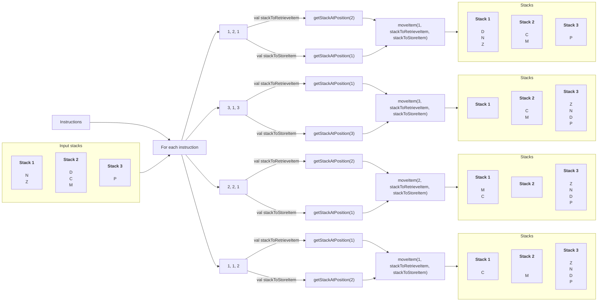

## Preface

Now that we have the following data structure from our [previous post](./2023-06-07-sanitizer.md), we can start thinking about how we can execute the commands to fill up the stacks.

The data structures our sanitizer provides, are the stacks and the instructions.

```kotlin
[
  Stack('N', 'Z'),      // Stack 1
  Stack('D', 'C', 'M'), // Stack 2
  Stack('P')            // Stack 3
]
```

```kotlin
[
  Triple(1, 2, 1),
  Triple(3, 1, 3),
  Triple(2, 2, 1),
  Triple(1, 1, 2)
]
```

## Design

Now that we have all of our stacks, we need to execute the instructions one by one. We know that the order of the instruction is important, because that tells us how many items to move and from which to which stack to move that item. So, if we look at the assignment again, we see that an instruction looks like this.

> move 1 from 2 to 1

This means that the first item in the triple is the number of stacks to move, the second item is the stack where we take the item from. And the last item is the stack where we need to store the item. So if we put it in code, we get something like this.

```kotlin
val noItemsToMove = Triple.first
val stackToRetrieveItemIndex = Triple.second - 1
val stackToStoreItemIndex = Triple.third - 1
```

In the above code, we subtract one from the value because the instruction gives us a 1-based stack number. But our index is 0-based.

Now that our data is correct and has a meaning, we can start the think about the way we need to execute our logic.



## Implementation

### Business logic

Now we have an idea of our design, let's start implementing it in our PartOne class.

```kotlin
class PartOne(
    val sanitizer: Sanitizer
) {
    fun getResult(): String {
        val stacks = sanitizer.getStacks()
        sanitizer.getInstructions()?.forEach {
            val noItemsToMove = it.first
            val stackToRetrieveItemIndex = it.second - 1
            val stackToStoreItemIndex = it.third - 1

            val stackToRetrieveItem = stacks.get(stackToRetrieveItemIndex)
            val stackToStoreItem = stacks.get(stackToStoreItemIndex)

            moveItem(noItemsToMove, stackToRetrieveItem, stackToStoreItem)
        }

        return stacks.joinToString { // Step 3
            it.peek().toString()
        }
    }

    /***
     * Move a specific number of items from one stack to another and remove them from the
     * stack where the items are moved from.
     *
     * @param noItemsToMove the number of items to move
     * @param stackToRetrieveItem the stack where the items are moved from
     * @param stackToStoreItem the stack where the items are moved to
     */
    private fun moveItem(noItemsToMove: Int, stackToRetrieveItem: Stack<Char>, stackToStoreItem: Stack<Char>) {
        for (i in 1..noItemsToMove) { // Step 1
            val item = stackToRetrieveItem.pop() // Step 2
            stackToStoreItem.push(item)
        }
    }
}
```
{: file="aoc-2022/day5/src/main/kotlin/aoc/PartOne.kt" }

Inside the `moveItem` method we have a for-loop, _Step 1_, which ranges from 1 to the `noItemsToMove`. This is done because this way our for-loop is exlusive. Which means that the loop is only executed once, if the `noItemsToMove` contains the value `1`. If it was inclusive it would be executed twice, once for the `0` and once for the `1` value in the loop.

At _Step 2_ we use the `pop` function on the `stackToRetrieve` variable because that gives us the first item in the stack and removes it from that stack [(Oracle, 2023)](https://docs.oracle.com/javase/8/docs/api/java/util/Stack.html#pop--) whereas the `peek()` method returns the first item on the stack without removing that item [(Oracle, 2023)](https://docs.oracle.com/javase/8/docs/api/java/util/Stack.html#peek--).

And finally at _Step 3_ we concatenate all the first items from each stack together to form our result.

### Test case

We have written our business logic, and for our test input we now that the expected output for the test data is `CMZ`. So we can start to write our test case.

```kotlin
class PartOneTest {
    @Test
    fun testGetResult() {
        // Arrange
        val resource = {}::class.java.getResource("/input.txt")
        val sanitizer = Sanitizer(resource)
        val sut = PartOne(sanitizer)
        val expectedResult = "CMZ"

        // Act
        val result = sut.getResult()

        // Assert
        assertEquals(expectedResult, result)
    }
}
```
{: file="aoc-2022/day5/src/test/kotlin/aoc/PartOne.kt" }
