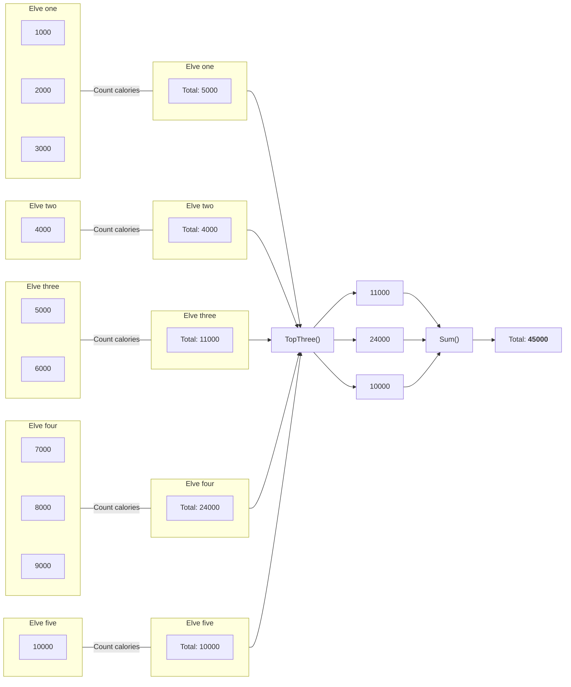

## Preface

Now that we have the following data structure from our [previous post](./2023-03-28-sanitizer.md), we start implementing the business logic to retrieve the three highest combined
number of calories and add them together.

```kotlin
[
  [ 1000, 2000, 3000 ], // Elve one
  [ 4000 ],             // Elve two
  [ 5000, 6000 ],       // Elve three
  [ 7000, 8000, 9000 ], // Elve four
  [ 10000 ]             // Elve five
]
```
{: file="Elve structure" }

## Design

The objective of the second part of the assignment is to retrieve the three highest amounts of combined calories a single elve is carrying, and them adding those three combined
calories together. So we need to sum up all the calories in each list from our data structure and get the three biggest numbers. Once we have those three numbers, we need to add
them together for our final result.



## Implementation

### Business logic

Now we know what we want our code to do, let's start implementing it in our `PartOne` class.

```kotlin
class PartTwo(
    private val sanitizer: Sanitizer
) {
    fun getResult(): Int {
        val data = sanitizer.getItems()
        val totalCalories = data?.map { it.sum() }              // 1
        val sortedCalories = totalCalories?.sortedDescending()  // 2
        val topThreeMostCalories = sortedCalories?.subList(     // 3
            fromIndex = 0,
            toIndex = 3 // toIndex is three instead of two because it's exclusive
        )
        val mostCalories = topThreeMostCalories?.sum()          // 4

        return mostCalories ?: -1
    }
}
```
{: file="aoc-2022/day1/src/main/kotlin/aoc/PartTwo.kt" }

What our code does is, it creates a new list based on the input in _step 1_. This new list will contain the summed up values of the calories for each elve. This data structure
looks like this

```kotlin
[
  5000,
  4000,
  11000,
  24000,
  10000
]
```

Next, in _step 2_ we sort the new list in ascending order. Thus the highest number is placed in the front of the list, and the smallest number at the end of the list. We then retrieve
the first 3 items from that list in _step 3_, as those are the three biggest numbers in the list.

Then finally we sum up the three numbers in that list, and return that value.

### Test case

Because we know that the three biggest numbers from the elves are __11000__, __24000__ and __10000__, we can add them up to get a total of __45000__ and use that as our
expected outcome in the test case.

So we can write a test case that validates our test input to the outcome of __45000__. Right now we can update the `PartTwoTest` class with the following contents.

```kotlin
class PartTwoTest {
    @Test
    fun testGetResult() {
        // Arrange
        val resource = {}::class.java.getResource("/input.txt")
        val sanitizer = Sanitizer(resource)
        val sut = PartTwo(sanitizer)
        val expectedCalories = 45000

        // Act
        val result = sut.getResult()

        // Assert
        assertEquals(expectedCalories, result)
    }
}
```
{: file="aoc-2022/day1/src/test/kotlin/aoc/PartTwoTest.kt" }

