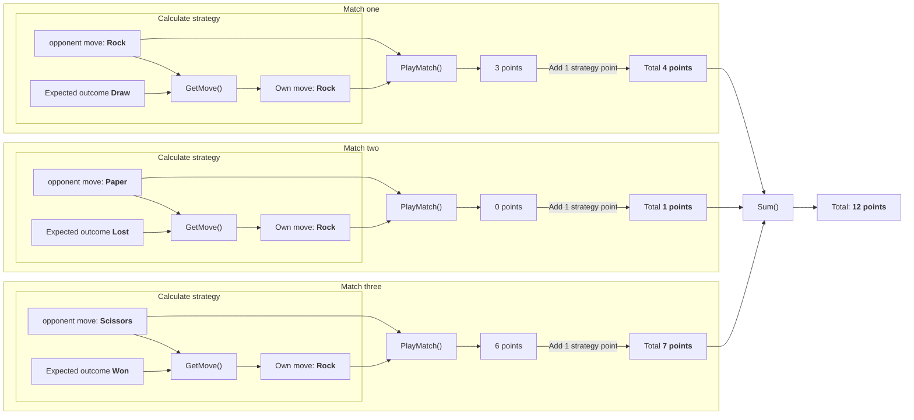

## Preface

Now that we have the following data structure from our [previous post](./2023-04-05-sanitizer.md), we can start by implementing the business logic to calculate the
outcome of each match. Before we can do that, we need to setup three conversion tables. One for converting each strategy, one for each expected outcome and another
one to convert each match outcome to points.

```kotlin
[
  { "A", "Y" }, // Match 1
  { "B", "X" }, // Match 2
  { "C", "Z" }  // Match 3
]
```

### Conversion table for strategies

> A for Rock, B for Paper, and C for Scissors
> [...] X for Rock, Y for Paper, and Z for Scissors

| Rock | Paper | Scissors |
|:----:|:-----:|:--------:|
| A    | B     | C        |

### Conversion table for expected match outcomes

> X means [...] lose, Y means [...] draw, and Z means [...] win

| Lost | Draw  | Won      |
|:----:|:-----:|:--------:|
| X    | Y     | Z        |

### Conversion table for the match outcome

> score for the outcome of the round [...] 0 if you lost, 3 if the round was a draw, and 6 if you won

| 0 points          | 3 points            | 6 points         |
|:-----------------:|:-------------------:|:----------------:|
| Rock - Paper      | Rock - Rock         | Rock - Scissors  |
| Paper - Scissors  | Paper - Paper       | Paper - Rock     |
| Scissors - Rock   | Scissors - Scissors | Scissors - Paper |

## Design

So now that we know what our opponents strategy is going to be, and what the expected outcome is going to be we need to think about how we can get our move based on the expected outcome.

So we need to calculate which move we need to make to get our desired outcome. So if the opponent chooses Rock, our move
is going to be Paper. And based on that outcome we can then play the match to get the points as described in the previous
table and the move points we've been given:

> the score for the shape you selected [...] 1 for Rock, 2 for Paper, and 3 for Scissors

So with the given sample data, and the conversion tables we get the following diagram.



Once all the matches have been played, and the points calculated we can add all outcomes togheter for our end result.

## Implementation

### Business logic

Now we know what we want our code to do, let’s start implementing it in our PartOne class.

```kotlin
class PartTwo(
    private val sanitizer: Sanitizer
) {
    fun getResult(): Int {
        val data = sanitizer.getItems()
        val points = data?.map {
            val strategyPoints = when(getMove(it.first, it.second)) {
                "A" -> 1    // Rock
                "B" -> 2    // Paper
                else -> 3   // Scissors
            }
            val roundOutcome = when(it.second) {
                "X" -> 0    // Lost
                "Y" -> 3    // Draw
                else -> 6   // Won
            }

            strategyPoints + roundOutcome
        }

        val totalRoundsOutcome = points?.sum()

        return totalRoundsOutcome ?: -1;
    }

    /**
     * Get the expected move based on the expected outcome and the opponents move
     *
     * @param opponentMove the move the opponent is going to make
     * @param expectedOutcome the outcome that is expected
     * @return our move
     */
    private fun getMove(opponentMove: String, expectedOutcome: String): String =
        when(expectedOutcome) {
            "X" -> when(opponentMove) { // Lost
                "A" -> "C"  // Opponent: Rock, own: Scissors
                "B" -> "A"  // Opponent: Paper, own: Rock
                else -> "B" // Opponent: Scissors, own: Paper
            } // Won
            "Y" -> opponentMove // Draw
            else -> when(opponentMove) { // Won
                "A" -> "B"  // Opponent: Rock, own: Paper
                "B" -> "C"  // Opponent: Paper, own: Scissors
                else -> "A" // Opponent: Scissors, own: Rock
            }
        }
}
```
{: file="aoc-2022/day2/src/main/kotlin/aoc/PartOne.kt" }


### Test case

Because we know that we have a list of all round outcomes, we know that we can sum each item in the list to get the total score. As you can see in our previous diagram, the
total score of the sample input will be __12__.


So we can write a test case that validates our test input to the outcome of __12__. Right now we can update the `PartTwoTest` class with the following contents.

```kotlin
class PartTwoTest {
    @Test
    fun testGetResult() {
        // Arrange
        val resource = {}::class.java.getResource("/input.txt")
        val sanitizer = Sanitizer(resource)
        val sut = PartTwo(sanitizer)
        val expectedNumberOfPoints = 12

        // Act
        val result = sut.getResult()

        // Assert
        assertEquals(expectedNumberOfPoints, result)
    }
}
```
{: file="aoc-2022/day2/src/test/kotlin/aoc/PartOne.kt" }
