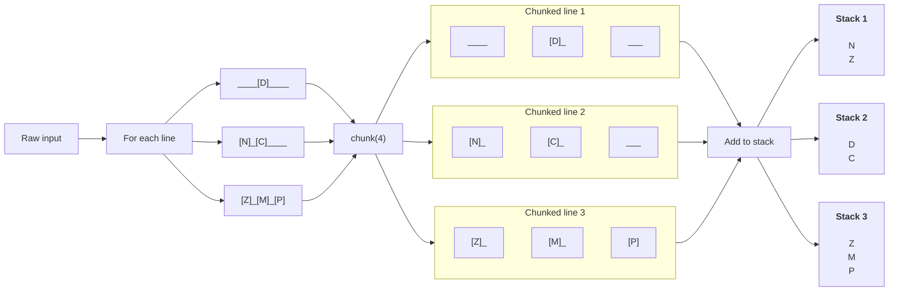
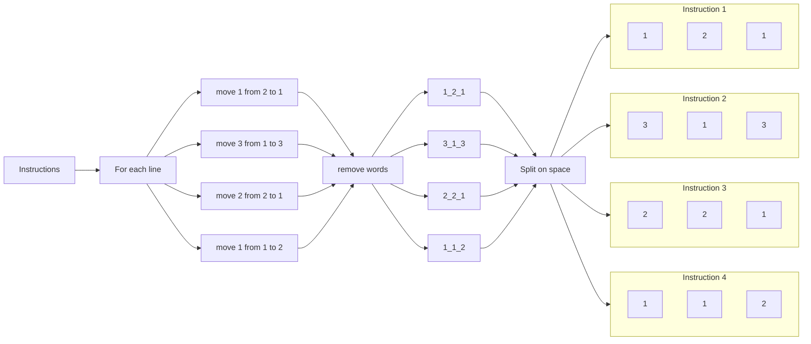

## Preface

The objective of the fourth day is available on the [advent of code](https://adventofcode.com/2022/day/5) website, so it won't be shared here. On this page only the steps of achieving a solution are given with a solution build in Kotlin.

## Design

When reading the assignment we see that we need to setup stacks with specific instructions. And if we look at the input data, we see that the data consists of two components. Namely the stacks and the instructions on how to setup the stacks.

We've got the following raw input.

```
    [D]    
[N] [C]    
[Z] [M] [P]
 1   2   3 

move 1 from 2 to 1
move 3 from 1 to 3
move 2 from 2 to 1
move 1 from 1 to 2
```
{: file="Raw input" }

The first half of the input are the stacks, which are labeled 1 to 3. Below the stacks we get the instructions. Now if we look a bit closer we can see that a white line seperates the stacks from the instructions. We can use that line to split the data into the two components we've identitified.

This will give us the following raw data

```
    [D]    
[N] [C]    
[Z] [M] [P]
 1   2   3 
```
{: file="Stacks" }

```
move 1 from 2 to 1
move 3 from 1 to 3
move 2 from 2 to 1
move 1 from 1 to 2
```
{: file="Instructions" }

### Stacks

For the raw input of the stacks we want to put them into actual stacks. We do this by searching for each block (`[x]`) and adding that to the corresponding stack. We can get each block by chunking each line on four characters because we know that a block consists of three characters, two `[` `]` brackets and the actual character. But to get the next block we also need to remove the space dividing each block. Thus chunking on four characters but only reading the character in the second index.

For the last item in the line, this will result in a chunk of three characters because there is no trailing space.

In the following diagram, the spaces are marked as underscores (`_`) for readability.



### Instructions

In order to get the instructions we need to identity which information for a single instruction is required to exeute the logic.

So a single instruction looks like this

```
move 1 from 2 to 1
```

Which means that we need to `move 1` block from `stack 1` to `stack 2`. Thus, if we extract those three number and put it into a tuple, the business logic can add the `move` and `stack` contexts to those numbers.

To only get the numbers, we can remove the words in the instruction and split each instruction on the spaces.



## Implementation

### Sanitizer

Now we now how we want our data structure to look like, we can start creating the `getStacks(): List<Stack<Char>>` and `getInstructions(): List<Triple<Int, Int, Int>>` methods inside our `Sanitizer` class.

```kotlin

```
{: file="aoc-2022/day5/src/main/kotlin/aoc/Sanitizer.kt" }

### Test case

To validate that our logic works as expected, we create a test case based on the sample data from the assignment. This way we can validate that our sanitizer gives us the correct data structure which we can use in the assignments.

```kotlin

```
{: file="aoc-2022/day5/src/test/kotlin/aoc/SanitizerTest.kt" }
