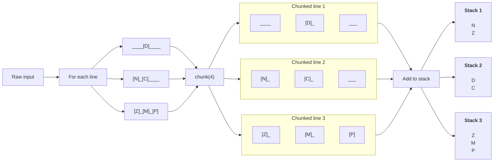
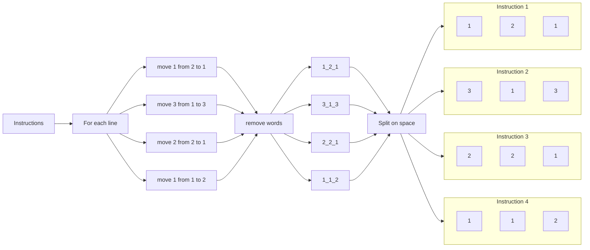

## Preface

The objective of the fifth day is available on the [advent of code](https://adventofcode.com/2022/day/5) website, so it won't be shared here. On this page only the steps of achieving a solution are given with a solution build in Kotlin.

## Design

When reading the assignment we see that we need to setup stacks with specific instructions. And if we look at the input data, we see that the data consists of two components. Namely the stacks and the instructions on how to setup the stacks.

We've got the following raw input.

```
    [D]    
[N] [C]    
[Z] [M] [P]
 1   2   3 

move 1 from 2 to 1
move 3 from 1 to 3
move 2 from 2 to 1
move 1 from 1 to 2
```
{: file="Raw input" }

The first half of the input are the stacks, which are labeled 1 to 3. Below the stacks we get the instructions. Now if we look a bit closer we can see that a white line seperates the stacks from the instructions. We can use that line to split the data into the two components we've identitified.

This will give us the following raw data

```
    [D]    
[N] [C]    
[Z] [M] [P]
 1   2   3 
```
{: file="Stacks" }

```
move 1 from 2 to 1
move 3 from 1 to 3
move 2 from 2 to 1
move 1 from 1 to 2
```
{: file="Instructions" }

### Stacks

For the raw input of the stacks we want to put them into actual stacks. We do this by searching for each block (`[x]`) and adding that to the corresponding stack. We can get each block by chunking each line on four characters because we know that a block consists of three characters, two `[` `]` brackets and the actual character. But to get the next block we also need to remove the space dividing each block. Thus chunking on four characters but only reading the character in the second index.

For the last item in the line, this will result in a chunk of three characters because there is no trailing space.

In the following diagram, the spaces are marked as underscores (`_`) for readability.



### Instructions

In order to get the instructions we need to identity which information for a single instruction is required to exeute the logic.

So a single instruction looks like this

```
move 1 from 2 to 1
```

Which means that we need to `move 1` block from `stack 1` to `stack 2`. Thus, if we extract those three number and put it into a tuple, the business logic can add the `move` and `stack` contexts to those numbers.

To only get the numbers, we can remove the words in the instruction and split each instruction on the spaces.



## Implementation

### Sanitizer

Now we now how we want our data structure to look like, we can start creating the `getStacks(): List<Stack<Char>>` and `getInstructions(): List<Triple<Int, Int, Int>>` methods inside our `Sanitizer` class.

#### getStacks method

```kotlin
fun getStacks(): List<Stack<Char>> {
    val stacks = mutableListOf<Stack<Char>>()
    val stackCharacterSize = 4

    resource
        ?.readText()
        ?.split("\n\n") // Step 1
        ?.first() // Step 2
        ?.split("\n")
        ?.dropLast(1)  // Step 3
        ?.reversed() // Step 4
        ?.forEach {
            var currentStackIndex = 0

            it.chunked(stackCharacterSize) { // Step 5
                val character = it
                    .removePrefix("[")
                    .removeSuffix("]")
                    .trim()
                    .firstOrNull()

                if (stacks.elementAtOrNull(currentStackIndex) == null) { // Step 6
                    stacks.add(currentStackIndex, Stack<Char>())
                }

                character?.let { // Step 7
                    stacks.elementAt(currentStackIndex).push(it)
                }

                currentStackIndex++
            }
        }

    return stacks
}
```
{: file="aoc-2022/day5/src/main/kotlin/aoc/Sanitizer.kt" }

The first thing we do, is splitting the string on an empty line which is represented by two newline characters (`\n\n`) at _Step 1_. Because we know that the items above the empty line are the stacks we take the first result of the split method at _Step 2_.

Because the stacks input also contain the stack labels which we don't need, we remove that line entirely. Because we know that's the last line before the empty line we can remove the last item in the list that's present after the `split("\n\n").first()` call. We do this at _Step 3_.

Because the way stacks work, they're first in first out we the order of insertion is important. If we insert an item, that is also the first item we can retrieve. Because we need to setup characters based on a top-down structure, the first item we can retrieve is actually the item at the bottom. But looking at the example, they say the the top item is the first item we need to retrieve. So at _Step 4_ we reverse the stacks after we've removed the last line with all the stack labels.

At _Step 5_ we read each line in chunks of 4 characters. This is done because at our design-phase we've notificed that each stack block consists of 1 character, with two block brackets and a trailing white space. Thus counted up to four characters in total.

At _Step 6_ we turn the chunked items into a `Triple` when the character isn't null or empty. We can assure that the character will be null if it's empty because of our call to `firstOrNull()` after we've stripped all unnecessarry items from the character block. Using the `let` lambda, we can execute the code of adding the character to the stack only when the character isn't null.

Finally, at _Step 7_ we add the character to the stack if the element isn't null using the `let` function [(Jetbrains, n.d.)](https://kotlinlang.org/api/latest/jvm/stdlib/kotlin/let.html).

This will give us the following data structure for the stacks.

```kotlin
[
  Stack('N', 'Z'),      // Stack 1
  Stack('D', 'C', 'M'), // Stack 2
  Stack('P')            // Stack 3
]
```

#### getInstructions method

```kotlin
fun getInstructions(): List<Triple<Int, Int, Int>>? =
    resource
        ?.readText()
        ?.split("\n\n") // Step 1
        ?.last() // Step 2
        ?.split("\n")
        ?.map {
            val items = it
                .replace("move ", "")
                .replace("from ", "")
                .replace("to ", "")
                .split(" ")
                .map{ it.toInt() }

            Triple( // Step 3
                items.get(0),
                items.get(1),
                items.get(2)
            )
        }
```

The first thing we do, is splitting the string on an empty line which is represented by two newline characters (`\n\n`) at _Step 1_. Because we know that the items below the empty line are the instructions we take the last result of the split method at _Step 2_.

And finally at _Step 3_ we turn the results into a Triple data type, which according to the documentation:

> Represents a triad of values.

[(Jetbrains, n.d.)](https://kotlinlang.org/api/latest/jvm/stdlib/kotlin/-triple/)

This will result in the following data structure.

```kotlin
[
  Triple(1, 2, 1),
  Triple(3, 1, 3),
  Triple(2, 2, 1),
  Triple(1, 1, 2)
]
```

### Test case

To validate that our logic works as expected, we create a test case based on the sample data from the assignment. This way we can validate that our sanitizer gives us the correct data structure which we can use in the assignments.

```kotlin
class SanitizerTest {
    @Test
    fun testGetStacks() {
        // Arrange
        val resource = {}::class.java.getResource("/input.txt")
        val sut = Sanitizer(resource)
        val expectedStack1 = Stack<Char>() // Step 1
        val expectedStack2 = Stack<Char>()
        val expectedStack3 = Stack<Char>()

        expectedStack1.push('Z') // Step 2
        expectedStack1.push('N')
        expectedStack2.push('M')
        expectedStack2.push('C')
        expectedStack2.push('D')
        expectedStack3.push('P')

        val expectedStacks = listOf(
            expectedStack1,
            expectedStack2,
            expectedStack3
        )

        // Act
        val result = sut.getStacks()

        // Assert
        assertContentEquals(expectedStacks, result)
    }

    @Test
    fun testGetInstructions() {
        // Arrange
        val resource = {}::class.java.getResource("/input.txt")
        val sut = Sanitizer(resource)
        val expectedInstructions = listOf(
            Triple(1, 2, 1),
            Triple(3, 1, 3),
            Triple(2, 2, 1),
            Triple(1, 1, 2)
        )

        // Act
        val result = sut.getInstructions()

        // Assert
        assertContentEquals(expectedInstructions, result)
    }
}
```
{: file="aoc-2022/day5/src/test/kotlin/aoc/SanitizerTest.kt" }

Unlinke the previous days, this test class has two test methods. One for the `getStacks()` method and one for the `getInstructions()` method. We know how our expected stacks need to look, so we create each stack and push the expected contents one by one at _Step 1_ and _Step 2_.
