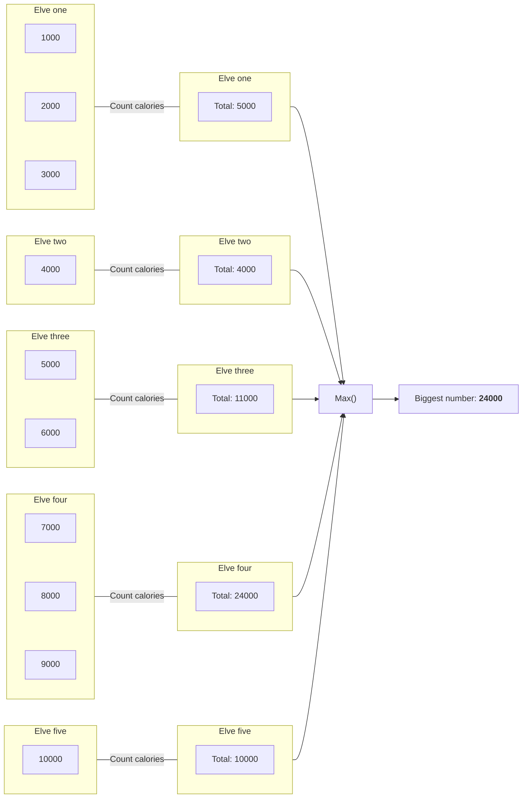

## Preface

Now that we have the following data structure from our [previous post](./2023-03-28-sanitizer.md), we start implementing the business logic to retrieve the highest combined
number of calories.

```kotlin
[
  [ 1000, 2000, 3000 ], // Elve one
  [ 4000 ],             // Elve two
  [ 5000, 6000 ],       // Elve three
  [ 7000, 8000, 9000 ], // Elve four
  [ 10000 ]             // Elve five
]
```
{: file="Elve structure" }

## Design

The objective of the first part of the assignment is to retrieve the highest amount of combined calories a single elve is carrying. So we need to sum up all the calories
in each list from our data structure and get the biggest number.



## Implementation

### Business logic

Now we know what we want our code to do, let's start implementing it in our `PartOne` class.

```kotlin
class PartOne(
    private val sanitizer: Sanitizer
) {
    fun getResult(): Int {
        val data = sanitizer.getItems()
        val totalCalories = data?.map { it.sum() }    // 1
        val mostCalories = totalCalories?.maxOrNull() // 2

        return mostCalories ?: -1                     // 3
    }
}
```
{: file="aoc-2022/day1/src/main/kotlin/aoc/PartOne.kt" }

What our code does is, it creates a new list based on the input in _step 1_. This new list will contain the summed up values of the calories for each elve. This data structure
looks like this

```kotlin
[
  5000,
  4000,
  11000,
  24000,
  10000
]
```

Next, in _step 2_ we get the biggest number from the list, which will be `24000`. And in _step 3_ we return that value, or `-1` if the input data was null.

### Test case

Because we know that we have a list of calories for each elve, we know that we can sum each list to get the total amount of calories for that elve. Once we have the combined
calories for each elve we can return the biggest number of combined calories. As you can see in our design diagram, elve four carries the most calories with a combined
total of __24000__.

So we can write a test case that validates our test input to the outcome of __24000__. Right now we can update the `PartOneTest` class with the following contents.

```kotlin
class PartOneTest {
    @Test
    fun testGetResult() {
        // Arrange
        val resource = PartOneTest::class.java.getResource("/input.txt")
        val sanitizer = Sanitizer(resource)
        val sut = PartOne(sanitizer)
        val expectedCalories = 24000

        // Act
        val result = sut.getResult()

        // Assert
        assertEquals(expectedCalories, result)
    }
}
```
{: file="aoc-2022/day1/src/test/kotlin/aoc/PartOneTest.kt" }

