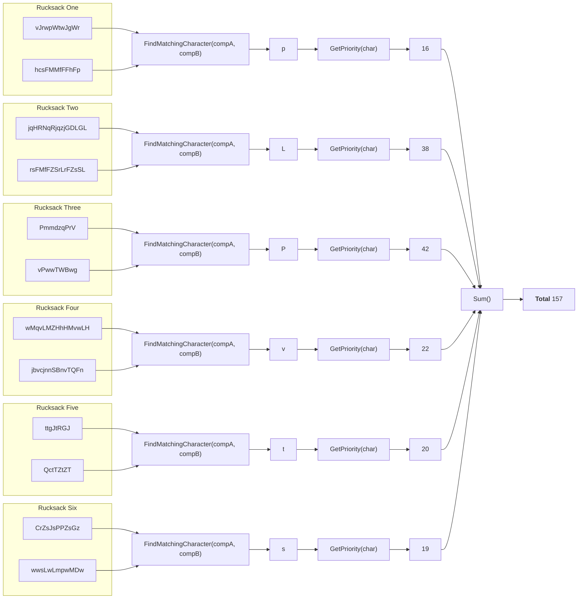

## Preface

Now that we have the following data structure from our [previous post](./2023-04-26-sanitizer.md), we can start by thinking about the business logic to retrieve the code that's inside all the rucksacks.

The data structure our sanitizer provides, looks like this.

```kotlin
[
    { "vJrwpWtwJgWr"    , "hcsFMMfFFhFp"     }, // Rucksack 1
    { "jqHRNqRjqzjGDLGL", "rsFMfFZSrLrFZsSL" }, // Rucksack 2
    { "PmmdzqPrV"       , "vPwwTWBwg"        }, // Rucksack 3
    { "wMqvLMZHhHMvwLH" , "jbvcjnnSBnvTQFn"  }, // Rucksack 4
    { "ttgJtRGJ"        , "QctTZtZT"         }, // Rucksack 5
    { "CrZsJsPPZsGz"    , "wwsLwLmpwMDw"     }  // Rucksack 6
]
```

## Design

So now that we have our rucksacks with each compartment seperated, we can think about how we want to setup our business logic. So to retrieve the code from all the rucksacks, we need to get the unique character that's present in both compartments.

So functionally, our design will look something like this.



The priority is based on this information.

> Lowercase item types a through z have priorities 1 through 26. <br>
> Uppercase item types A through Z have priorities 27 through 52.

And if we sum up each priority of our item types, we get the expected output of <b>157</b>

## Implementation

### Business logic

Now we know what we want our code to do, let’s start implementing it in our PartOne class.

```kotlin
class PartOne(
    private val sanitizer: Sanitizer
) {
    fun getResult(): Int {
        val result = sanitizer.getItems()
            ?.map {
                findMatchingCharacter(it.first, it.second)
            }?.sumOf {
                getPriority(it)
            }

        return result ?: -1
    }

    /**
     * Find the first character in compartment A that is also
     * present in compartment B
     *
     * @param compA the first compartment of the rucksack
     * @param compB the second compartment of the rucksack
     * @return the character that is present in both compartments
     *         or an empty char
     */
    private fun findMatchingCharacter(compA: String, compB: String): Char {
        compA.forEach {
            if (compB.contains(it)) {
                return it
            }
        }

        return Char.MIN_VALUE
    }

    /**
     * Get the priority of a character based on the following information
     *
     * Lowercase item types a through z have priorities 1 through 26.
     * Uppercase item types A through Z have priorities 27 through 52.
     *
     * @param character the character for which to get the property
     * @return the priority of the given character
     */
    private fun getPriority(character: Char): Int {
        val priorityAlphabet = "abcdefghijklmnopqrstuvwxyzABCDEFGHIJKLMNOPQRSTUVWXYZ"
        return priorityAlphabet.indexOf(character) + 1
    }
}
```
{: file="aoc-2022/day3/src/main/kotlin/aoc/PartOne.kt" }

In our code we use the `sumOf` method from Kotlin which allows us to return the sum of all values produced by the selector function. This is applied to each element in the collection [(Jetbrains, n.d.)](https://kotlinlang.org/api/latest/jvm/stdlib/kotlin.collections/sum-of.html). So this means that for each element the result of our `getPriority` method is summed up.

In the `getPriority` method we get the priority based on the index plus one from our priority string. Because a - z is priority 1 - 27, we can base our priority on the length of the alphabet. We use the plus one, because the `indexOf` method is a 0-based index but we need the 1-based index position.

### Test case

Now that we've established that the expected test output is __157__ we can start setting up our test case.

```kotlin
class PartOneTest {
    @Test
    fun testGetResult() {
        // Arrange
        val resource = PartOneTest::class.java.getResource("/input.txt")
        val sanitizer = Sanitizer(resource)
        val sut = PartOne(sanitizer)
        val expectedNumberOfPoints = 157

        // Act
        val result = sut.getResult()

        // Assert
        assertEquals(expectedNumberOfPoints, result)
    }
}
```
{: file="aoc-2022/day3/src/test/kotlin/aoc/PartOne.kt" }
