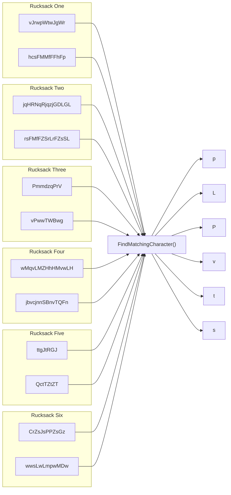

## Preface

Now that we have the following data structure from our [previous post](./2023-04-26-sanitizer.md), we can start by thinking about the business logic to retrieve the code that's inside all the rucksacks.

The data structure our sanitizer provides, looks like this.

```kotlin
[
    { "vJrwpWtwJgWr"    , "hcsFMMfFFhFp"     }, // Rucksack 1
    { "jqHRNqRjqzjGDLGL", "rsFMfFZSrLrFZsSL" }, // Rucksack 2
    { "PmmdzqPrV"       , "vPwwTWBwg"        }, // Rucksack 3
    { "wMqvLMZHhHMvwLH" , "jbvcjnnSBnvTQFn"  }, // Rucksack 4
    { "ttgJtRGJ"        , "QctTZtZT"         }, // Rucksack 5
    { "CrZsJsPPZsGz"    , "wwsLwLmpwMDw"     }  // Rucksack 6
]
```

## Design

So now that we have our rucksacks with each compartment seperated, we can think about how we want to setup our business logic. So to retrieve the code from all the rucksacks, we need to get the unique character that's present in both compartments.

So functionally, our design will look something like this.



So in our design we identity which character is present in both compartments and use that as output.

## Implementation

### Business logic

Now we know what we want our code to do, let’s start implementing it in our PartOne class.

```kotlin
class PartOne(
    private val sanitizer: Sanitizer
) {
    fun getResult(): String {
        val data = sanitizer.getItems()
        
        // TODO
    }
}
```
{: file="aoc-2022/day3/src/main/kotlin/aoc/PartOne.kt" }

### Test case


```kotlin
// TODO
```
{: file="aoc-2022/day3/src/test/kotlin/aoc/PartOne.kt" }
