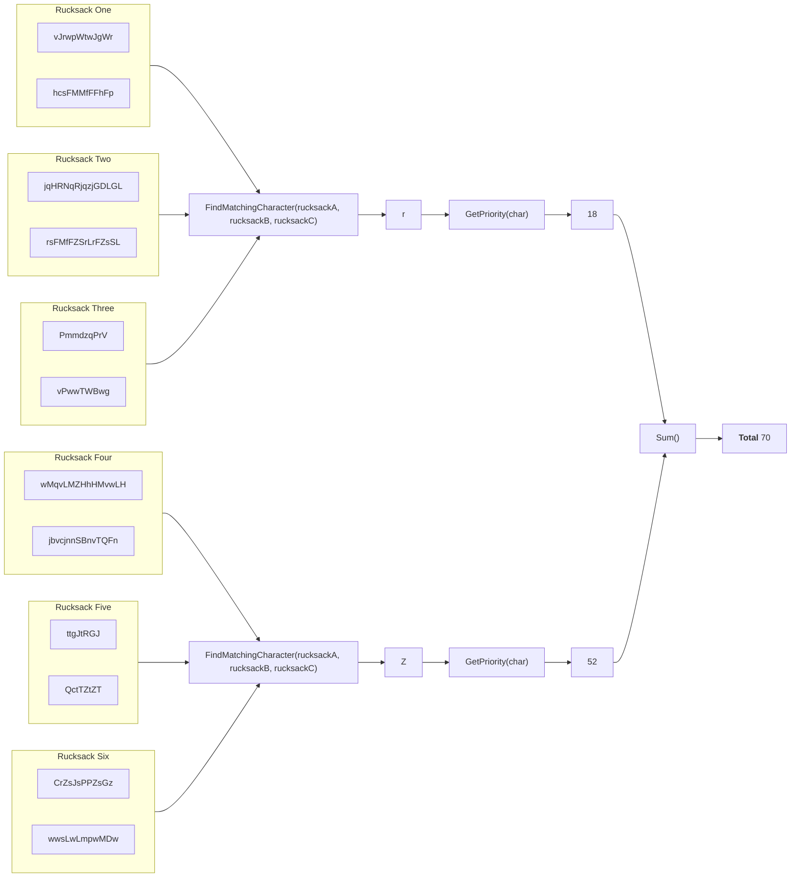

## Preface

Now that we have the following data structure from our [previous post](./2023-04-26-sanitizer.md), we can start by thinking about the business logic to retrieve the code that's inside all the rucksacks.

The data structure our sanitizer provides, looks like this.

```kotlin
[
    { "vJrwpWtwJgWr"    , "hcsFMMfFFhFp"     }, // Rucksack 1
    { "jqHRNqRjqzjGDLGL", "rsFMfFZSrLrFZsSL" }, // Rucksack 2
    { "PmmdzqPrV"       , "vPwwTWBwg"        }, // Rucksack 3
    { "wMqvLMZHhHMvwLH" , "jbvcjnnSBnvTQFn"  }, // Rucksack 4
    { "ttgJtRGJ"        , "QctTZtZT"         }, // Rucksack 5
    { "CrZsJsPPZsGz"    , "wwsLwLmpwMDw"     }  // Rucksack 6
]
```

## Design

So now that we have our rucksacks with each compartment seperated, we can think about how we want to setup our business logic. For this part we need to identify the matching character that's present in the three concurrent backpacks.
This means that we need to group all rucksacks by three rucksacks, and get the concurrent character for all three rucksacks.



The priority is based on this information.

> Lowercase item types a through z have priorities 1 through 26. <br>
> Uppercase item types A through Z have priorities 27 through 52.

And if we sum up each priority of our item types, we get the expected output of <b>70</b>

## Implementation

### Business logic

Now we know what we want our code to do, let’s start implementing it in our PartTwo class. For this to work we use the `chunked` method on our items iterable. The chunked method
can be used for splitting a collection into smaller a collection of smaller collections [(Jetbrains, n.d.)](https://kotlinlang.org/api/latest/jvm/stdlib/kotlin.collections/chunked.html).
So this means our test data will get the following data structure.

```kotlin
[
    [
        { "vJrwpWtwJgWrhcsFMMfFFhFp"          }, // Rucksack 1
        { "jqHRNqRjqzjGDLGLrsFMfFZSrLrFZsSL"  }, // Rucksack 2
        { "PmmdzqPrVvPwwTWBwg"                }, // Rucksack 3
    ],
    [
        { "wMqvLMZHhHMvwLHjbvcjnnSBnvTQFn"    }, // Rucksack 4
        { "ttgJtRGJQctTZtZT"                  }, // Rucksack 5
        { "CrZsJsPPZsGzwwsLwLmpwMDw"          }  // Rucksack 6
    ]
]
```

As you can see, we have added the two compartments togheter in our data structure, because there's no need for the two compartments to be different for each rucksack. This
can be seen in _step 1_ in our PartTwo implementation. Wereas in _step 2_ we 'chunk' our list into sublists with three strings each and find the matching character between the three strings.
Which we finally sum up in _step 3_.

```kotlin
class PartTwo(
    private val sanitizer: Sanitizer
) {
    fun getResult(): Int {
        val result = sanitizer.getItems()
        ?.map { // Step 1
            "${it.first}${it.second}"
        }?.chunked(3) { // Step 2
            val rucksackA = it[0]
            val rucksackB = it[1]
            val rucksackC = it[2]

            findMatchingCharacter(rucksackA, rucksackB, rucksackC)
        }?.sumOf { // Step 3
            getPriority(it)
        }

        return result ?: -1
    }

    /**
     * Find the first character in compartment A that is also
     * present in compartment B
     *
     * @param compA the first compartment of the rucksack
     * @param compB the second compartment of the rucksack
     * @return the character that is present in both compartments
     *         or an empty char
     */
    private fun findMatchingCharacter(compA: String, compB: String): Char {
        compA.forEach {
            if (compB.contains(it)) {
                return it
            }
        }

        return Char.MIN_VALUE
    }

    /**
     * Get the priority of a character based on the following information
     *
     * Lowercase item types a through z have priorities 1 through 26.
     * Uppercase item types A through Z have priorities 27 through 52.
     *
     * @param character the character for which to get the property
     * @return the priority of the given character
     */
    private fun getPriority(character: Char): Int {
        val priorityAlphabet = "abcdefghijklmnopqrstuvwxyzABCDEFGHIJKLMNOPQRSTUVWXYZ"
        return priorityAlphabet.indexOf(character) + 1
    }
}
```
{: file="aoc-2022/day3/src/main/kotlin/aoc/PartTwo.kt" }

As you can see, our `getPriority` method is exactly the same as for Part One of todays advent of code. However, `findMatchingCharacter` has changed quite a bit. Instead of searching for the
same character in two lists, we search in three lists. We only iterate over the first item and validate if each character is present in the other two strings. We can even streamline this code a bit
by only iterating over the smallest string. Because all three strings are checked for the matching character, we don't need to check characters that aren't available in one string.

So with the optimization, our `findMatchingCharacter` now looks like this.

```kotlin
/**
  * Find the first character in rucksack A that also
  * present in rucksacks B and C
  *
  * @param rucksackA the first rucksack
  * @param rucksackB the second rucksack
  * @param rucksackC the last rucksack
  * @return the character that is present in all three
  *         rucksacks or an empty char
  */
private fun findMatchingCharacter(rucksackA: String, rucksackB: String, rucksackC: String): Char {
    if (rucksackA.length > min(rucksackB.length, rucksackC.length)) {
        return findMatchingCharacter(rucksackB, rucksackC, rucksackA)
    }

    rucksackA.forEach {
        if (rucksackB.contains(it) && rucksackC.contains(it)) {
            return it
        }
    }

    return Char.MIN_VALUE
}
```

In the if-statement will check if rucksackA is bigger than the smallest rucksackB or rucksackC, if the statement is true it will call the `findMatchingCharacter` again but with the rucksacks in a different order.
This will generate the following call-stack based on our test input.

```kotlin
// First three items
// ---
// vJrwpWtwJgWrhcsFMMfFFhFp         -> Rucksack 1: 24 items
// jqHRNqRjqzjGDLGLrsFMfFZSrLrFZsSL -> Rucksack 2: 32 items
// PmmdzqPrVvPwwTWBwg               -> Rucksack 3: 18 items

findMatchingCharacter(rucksack1, rucksack2, rucksack3) // if (24 > min(32, 18) = 18) -> true
findMatchingCharacter(rucksack2, rucksack3, rucksack1) // if (32 > min(18, 24) = 18) -> true
findMatchingCharacter(rucksack3, rucksack1, rucksack2) // if (18 > min(24, 32) = 24) -> false


// Second three items
// ---
// wMqvLMZHhHMvwLHjbvcjnnSBnvTQFn   -> Rucksack 4: 30 items
// ttgJtRGJQctTZtZT                 -> Rucksack 5: 16 items
// CrZsJsPPZsGzwwsLwLmpwMDw         -> Rucksack 6: 24 items

findMatchingCharacter(rucksack4, rucksack5, rucksack6) // if (30 > min(16, 24) = 16) -> true
findMatchingCharacter(rucksack5, rucksack6, rucksack4) // if (16 > min(24, 30) = 24) -> false
```

### Test case

Now that we've established that the expected test output is __70__ we can start setting up our test case.

```kotlin
class PartTwoTest {
    @Test
    fun testGetResult() {
        // Arrange
        val resource = PartTwoTest::class.java.getResource("/input.txt")
        val sanitizer = Sanitizer(resource)
        val sut = PartTwo(sanitizer)
        val expectedNumberOfPoints = 70

        // Act
        val result = sut.getResult()

        // Assert
        assertEquals(expectedNumberOfPoints, result)
    }
}
```
{: file="aoc-2022/day3/src/test/kotlin/aoc/PartTwo.kt" }
