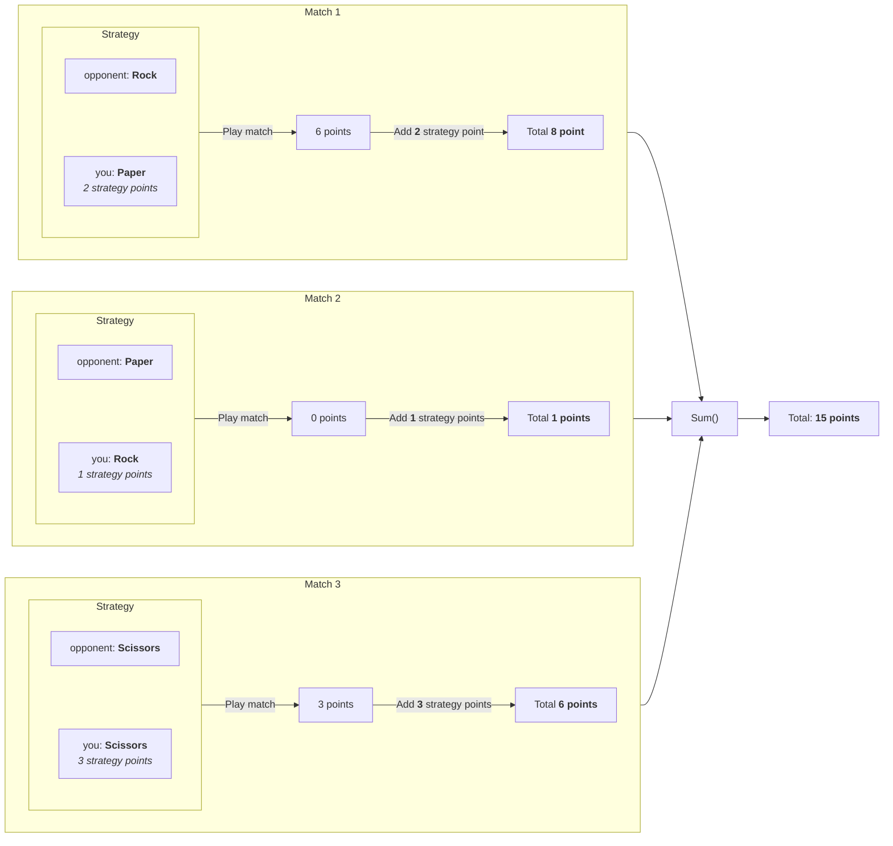

## Preface

Now that we have the following data structure from our [previous post](./2023-04-05-sanitizer.md), we can start by implementing the business logic to calculate the
outcome of each match. Before we can do that, we need to setup two conversion tables. One for converting each strategy and another one to convert each match outcome
to points.

```kotlin
[
  { "A", "Y" }, // Match 1
  { "B", "X" }, // Match 2
  { "C", "Z" }  // Match 3
]
```

### Conversion table for strategies

> A for Rock, B for Paper, and C for Scissors
> [...] X for Rock, Y for Paper, and Z for Scissors

| Rock | Paper | Scissors |
|:----:|:-----:|:--------:|
| A    | B     | C        |
| X    | Y     | Z        |

### Conversion table for the match outcome

> score for the outcome of the round [...] 0 if you lost, 3 if the round was a draw, and 6 if you won

| 0 points          | 3 points            | 6 points         |
|:-----------------:|:-------------------:|:----------------:|
| Rock - Paper      | Rock - Rock         | Rock - Scissors  |
| Paper - Scissors  | Paper - Paper       | Paper - Rock     |
| Scissors - Rock   | Scissors - Scissors | Scissors - Paper |

## Design

Now we know how are data is structured and we gave it a meaning. We can start to think about our business logic. The steps we need to take is that we need to get the
points for each match and combine them with the points for each strategy we played.

> the score for the shape you selected [...] 1 for Rock, 2 for Paper, and 3 for Scissors

So for the sample input we get the following diagram.



Once all the matches have been played, and the points calculated we can add all outcomes togheter for our end result.

## Implementation

### Business logic

Now we know what we want our code to do, let’s start implementing it in our PartOne class.

```kotlin
class PartOne(
    private val sanitizer: Sanitizer
) {
    fun getResult(): Int {
        val data = sanitizer.getItems()
        val points = data?.map {
            val strategyPoints = when(it.second) { // 1
                "X" -> 1    // Rock
                "Y" -> 2    // Paper
                else -> 3   // Scissors
            }
            val roundOutcome = when(it) { // 2
                // Lost
                Pair("A", "Z"),
                Pair("B", "X"),
                Pair("C", "Y") -> 0

                // Draw
                Pair("A", "X"),
                Pair("B", "Y"),
                Pair("C", "Z") -> 3

                // Won
                else -> 6
            }

            strategyPoints + roundOutcome
        }

        val totalRoundsOutcome = points?.sum()

        return totalRoundsOutcome ?: -1;
    }
}
```
{: file="aoc-2022/day2/src/main/kotlin/aoc/PartOne.kt" }

What our code does, is, it turns our matches list into a list of round outcomes. At _step 1_ the strategy points are calculated based on the information we've gotten from
the assignment. We only check for our own moves, because we don't get points for the move the opponent made.

Once we've gotten the score from our strategy, we calculate the points based on the round outcome. At _step 2_ we only check for winnings and a draw. This can be cleaned
up by splitting it into a seperate method or normalizing the data into `Rock`, `Paper` and `Scissors` instead of the current `A`, `B`, `X` etc.

So this will give us the following data structure.

```kotlin
[
  8,
  1,
  6
]
```

This list is finally summed up and return as the assignment outcome.

### Test case

Because we know that we have a list of all round outcomes, we know that we can sum each item in the list to get the total score. As you can see in our previous diagram, the
total score of the sample input will be __15__.


So we can write a test case that validates our test input to the outcome of __15__. Right now we can update the `PartOneTest` class with the following contents.

```kotlin
class PartOneTest {
    @Test
    fun testGetResult() {
        // Arrange
        val resource = PartOneTest::class.java.getResource("/input.txt")
        val sanitizer = Sanitizer(resource)
        val sut = PartOne(sanitizer)
        val expectedNumberOfPoints = 15

        // Act
        val result = sut.getResult()

        // Assert
        assertEquals(expectedNumberOfPoints, result)
    }
}
```
{: file="aoc-2022/day2/src/test/kotlin/aoc/PartOne.kt" }
