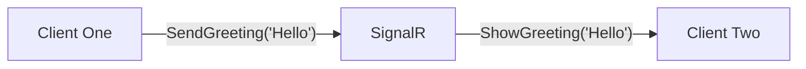

So at work we're currently using Azure Signal-R service for a real time chat feature inside an application. Because I
don't really understand how the Azure Signal-R service works, I thought let's figure it out.

## What is SignalR

Before we dig in, let's first understand what SignalR is.

According to Microsoft it's a "[...] library that simplifies adding real-time web functionality to apps. [..]". Which "[...] enables server-side code to push content to clients [...]" [(Microsoft, 2023)](https://learn.microsoft.com/nl-nl/aspnet/core/signalr/introduction?view=aspnetcore-7.0).

The SignalR library provides a way to use RPC (Remote Procedure Calls), to call a method from our client on the server. Or call a method from our server on the client. Let's suppose we have a small greeting application. In this application you can either be greeted by someone, or greet someone. With SignalR, this might look something like this.

In this example Client One calls the `SendGreeting` method on the SignalR server with _Hello_ as a parameter. In turn, the SignalR server calls the `ShowGreeting` message on Client Two with the _Hello_ parameter given from Client One.

### Transport protocol

To execute this RPC SignalR supports three transport protocols, WebSockets, Server-Sent Events and Long Polling.

SignalR supports three types of transport protocol to communicate between clients and server [(Microsoft, 2023)](https://learn.microsoft.com/nl-nl/aspnet/core/signalr/introduction?view=aspnetcore-7.0):

1. WebSockets
2. Server-Sent Events
3. Long Polling
