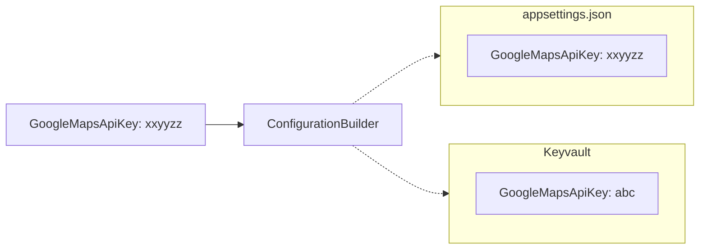

In our [previous post](./2024-04-10-set-up-configuration) we've learned that we can have multiple configuration sources, but how does .NET handle multiple sources which might contain the same key. Say, we have the following situation.

On our developer machine we use a value from `appsettings.json` but when deploying it to something like Azure we want to use Keyvault to access the `GoogleMapsApiKey` value.



## Multiple configuration source

Let's say, we need two configuration sources. One from our `appsettings.json` and a keyvault for our secrets. If both configurations contain the key `ExternalApiConnectionString` .NET will take the value from the source that was the last in chain in the configuration builder [(Microsoft, n.d.)](https://learn.microsoft.com/en-us/dotnet/core/extensions/configuration#alternative-hosting-approach). Given the following example, the value from keyvault would take precedent over the value in de `appsettings.json`.

```csharp
var azureKeyvaultAddress = "https://somekeyvault.vault.azure.net/";

var config = new ConfigurationBuilder()
    .AddJsonFile("appsettings.json")
    .AddAzureKeyVault(
        new Uri(azureKeyvaultAddress),
        new DefaultAzureCredential()
    )
    .Build();
```

Let's create the Bicep te deploy our keyvault to Azure with the expected `GoogleMapsApiKey` secret.

```bicep
resource keyvaultDeployment 'Microsoft.KeyVault/vaults@2022-07-01' = {
  name: 'keyvault-bartkessels-20240417'
  location: 'string'
  properties: {
    accessPolicies: [
      {
        applicationId: 'string'
        objectId: 'string'
        permissions: {
          certificates: [
            'string'
          ]
          keys: [
            'string'
          ]
          secrets: [
            'string'
          ]
          storage: [
            'string'
          ]
        }
        tenantId: 'string'
      }
    ]
    createMode: 'string'
    enabledForDeployment: bool
    enabledForDiskEncryption: bool
    enabledForTemplateDeployment: bool
    enablePurgeProtection: bool
    enableRbacAuthorization: bool
    enableSoftDelete: bool
    networkAcls: {
      bypass: 'string'
      defaultAction: 'string'
      ipRules: [
        {
          value: 'string'
        }
      ]
      virtualNetworkRules: [
        {
          id: 'string'
          ignoreMissingVnetServiceEndpoint: bool
        }
      ]
    }
    provisioningState: 'string'
    publicNetworkAccess: 'string'
    sku: {
      family: 'A'
      name: 'string'
    }
    softDeleteRetentionInDays: int
    tenantId: 'string'
    vaultUri: 'string'
  }
}
```

Save the Bicep-file as `main.bicep` and run the following Azure CLI command.

```shell
$ az deployment group create --resource-group myResourceGroup --template-file ./main.bicep
```