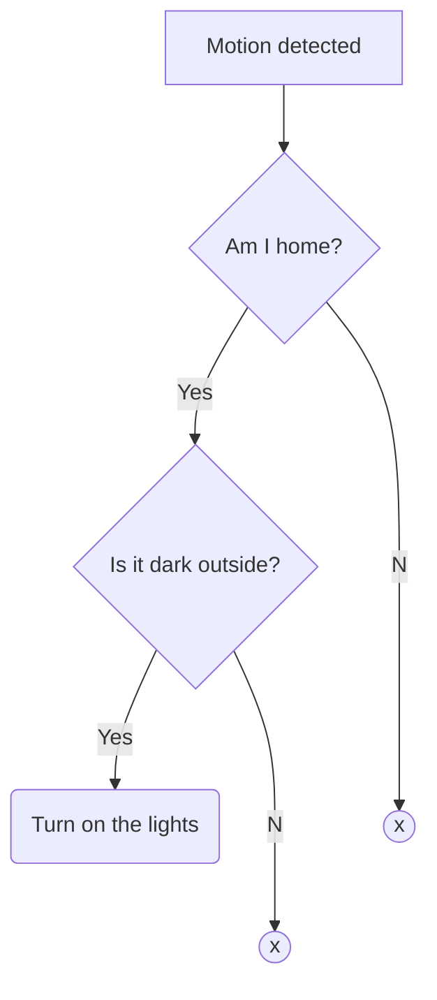
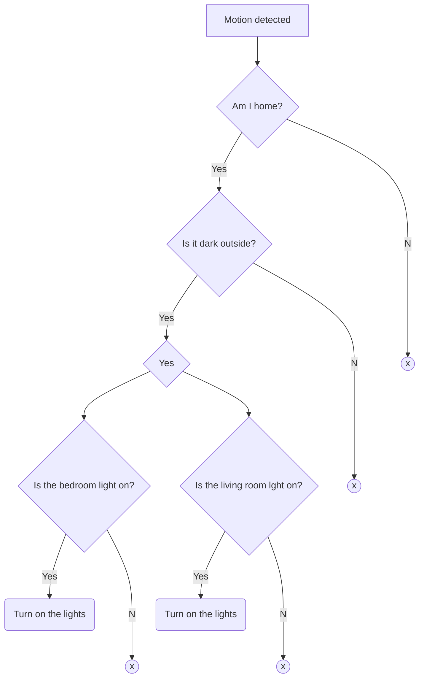

## Introduction

In the [previous post](./2023-09-07-and-condition.md) we've seen that we can use `and` conditions in automations. We also saw that there is an `or` condition operator. We'll in this post we're going to update our previous example and add an `or` condition.

If you remember the first case, we wanted to turn on the hallway lights when motion is detected using a motion sensor. However, the lights should only turn on when it's dark outside and when I'm at home. This gave us the following diagram.



## Case

For this post we want to expand our automation by only turning on the hallway lights when the previous conditions are met, and when either the bedroom lights are on or the living room lights are on. When either of those lights are off, we can safely assume that we are at home, however we chose to turn those lights of because we are in bed. Otherwise we would be in our bedroom with the lights on or in the living room with the lights on.

So, let's update our diagram with the new requirements.



## Conditions

In the [previous post](./2023-09-07-and-condition.md) we saw that we can use the `or` operator to add multiple conditions that will allow the execution of the automation when at least one of them is true.

So we have two conditions to add to the `or` operator

1. Lights bedroom are on
2. Lights living room are on

This will make sure our animation won't be executed if both lights are off, thus we can sleep without having to worry about the cats turning on the hallway lights.

## Automation YAML

Now we know how we can achieve our goal, let's create the actual automation.

```yaml
metadata:
  name: Motion in hallway
  description: Turn on the hallway lights when motion is detected while I'm home and it's dark outside

automations:
  # Trigger our automation when the motion sensor detects motion
  starters:
    - type:  device.state.MotionDetection
      state: motionDetectionEventInProgress
      is: true
      device: MS Hallway - Default

  # Setup our requirements
  condition:
    type: and
    conditions:
      # Setup our "when it's dark" requirement
      - type: time.between
        after: sunset
        before: sunrise
      # Setup our "when I'm home" requirement
      - type: home.state.HomePresence
        state: homePresenceMode
        is: HOME
      # Only turn the hallway lights on when either the bedroom light is on or the living room light is on
      - type: or
        conditions:
          - type: device.state.OnOff
            state: on
            is: true
            device: Bedroom Light - Bedroom
          - type: device.state.OnOff
            state: on
            is: true
            device: Living room Light - Living Room

  # Execute the following actions when motion is detected and our requirements are both met
  actions:
    - type: device.command.OnOff
      on: true
      devices: Hallway light - Hallway
```
