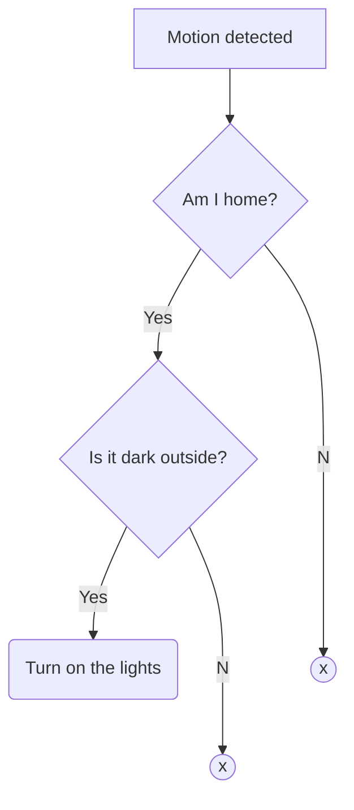

## Introduction

Since a couple of weeks Google has (finally!) added support for more advanced automations using YAML. Even though as of right now it's still in public preview, I've migrated all my automations to this new style.

## Case

The first thing I wanted to do was to turn on the lights in the hallway when motion is detected using a motion sensor. But they don't need to turn on every time motion is detected. Either because it's not dark outside or because I'm not at home.

We can see this as requirements that need to be met when motion detection is triggered. If we put it in a flow-diagram, it would look like this.



## Conditions

Every automation has the following properties.

* starters
* condition
* actions

As you can see, the property _condition_ is singular which implies we can only use a single condition for our automation. Luckily Google has created three _Condition operations_

1. `and`
  * When you use the and condition, your script will only run if all of the child conditions are met. [(Google, nd.)](https://support.google.com/googlenest/answer/13460475?sjid=8771963134352325461-NA#conditions&zippy=%2Cconditions%2Ccondition-operators)
2. `or`
  * When you use the or condition, your script will run when any of the child conditions occur. [(Google, nd.)](https://support.google.com/googlenest/answer/13460475?sjid=8771963134352325461-NA#conditions&zippy=%2Cconditions%2Ccondition-operators)
3. `not`
  * When you use the not condition, your script can't run if the child condition occurs.[(Google, nd.)](https://support.google.com/googlenest/answer/13460475?sjid=8771963134352325461-NA#conditions&zippy=%2Cconditions%2Ccondition-operators)

This means for our case to be executed properly we want the `and` operator. This will only turn on the lights when I'm at home and it's dark outside.

## Automation YAML

Now we know how we can achieve our goal, let's create the actual automation.

```yaml
metadata:
  name: Motion in hallway
  description: Turn on the hallway lights when motion is detected while I'm home and it's dark outside

automations:
  # Trigger our automation when the motion sensor detects motion
  starters:
    - type:  device.state.MotionDetection
      state: motionDetectionEventInProgress
      is: true
      device: MS Hallway - Default

  # Setup our requirements
  condition:
    type: and
    conditions:
      # Setup our "when it's dark" requirement
      - type: time.between
        after: sunset
        before: sunrise
      # Setup our "when I'm home" requirement
      - type: home.state.HomePresence
        state: homePresenceMode
        is: HOME

  # Execute the following actions when motion is detected and our requirements are both met
  actions:
    - type: device.command.OnOff
      on: true
      devices: Hallway light - Hallway
```
